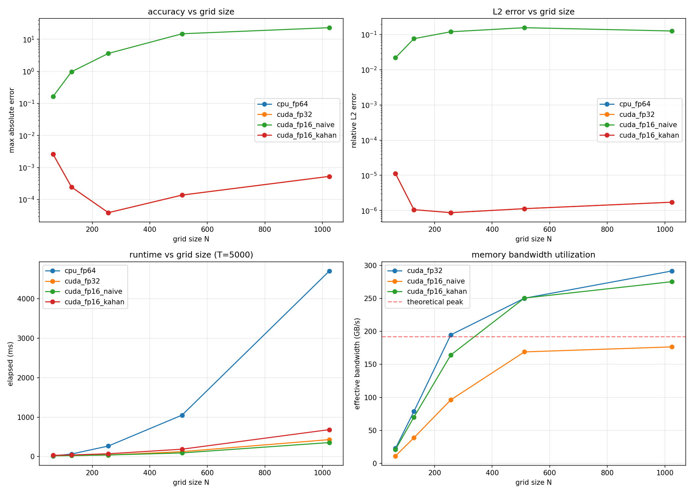

# Compensated summation for stencil computation on CUDA with reduced-precision storage

A semester project for the ACS (Архітектура Комп'ютерних Систем) course. We solve the 2D heat equation on an NVIDIA GPU, storing data in float16 to save memory bandwidth, and using Kahan compensated summation to recover float32-level accuracy despite the reduced-precision storage.

## What this project does

Heat spreads through a metal plate. We simulate this by discretizing the plate into a grid and updating each cell using its neighbors (a stencil operation), thousands of times. The core question: **can we store the temperature data in half precision (16-bit float, 2 bytes) instead of single precision (32-bit float, 4 bytes) without losing accuracy?**

The answer is yes, if we use Kahan compensated summation. Without compensation, half-precision errors compound catastrophically over thousands of timesteps. With compensation, we recover the exact same accuracy as full float32 computation.

## Theory

### The heat equation

The 2D heat equation describes how temperature evolves over time in a material:

$$\frac{\partial u}{\partial t} = k \left( \frac{\partial^2 u}{\partial x^2} + \frac{\partial^2 u}{\partial y^2} \right)$$

We use the FTCS (Forward Time, Central Space) finite difference scheme to approximate this. Each grid point is updated using the 5-point stencil with reach R=1 (center + 1 neighbor in each of 4 directions):

$$u_{i,j}^{n+1} = u_{i,j}^{n} + r \cdot \left( u_{i-1,j}^{n} + u_{i+1,j}^{n} + u_{i,j-1}^{n} + u_{i,j+1}^{n} - 4 u_{i,j}^{n} \right)$$

where $r = k \cdot \Delta t / \Delta x^2$ must be less than 0.25 for stability in 2D. Our code auto-computes $\Delta t$ to keep $r = 0.2$.

Higher-order stencils use wider reach (R=4 or R=8 cells outward along each axis) for better spatial accuracy. These are always axis-aligned (+ shape, no diagonals). With R=4 that's 17 points in 2D (4 directions x 4 cells + center), with R=8 that's 33 points.

### Float16 and the precision problem

IEEE 754 float16 has 10 bits of mantissa (~3.3 decimal digits) versus float32's 23 bits (~7 digits). When we store a stencil result as float16, we lose roughly 3-4 decimal digits every timestep. Over 5000 timesteps, these tiny rounding errors accumulate and the solution drifts far from the correct answer.

### Kahan compensated summation

Kahan's algorithm (1965) tracks what was lost in each rounding operation and adds it back next time:

1. Load the `__half` value from GPU memory and add the stored compensation to recover the "true" value
2. Do all stencil arithmetic in float32
3. Store the result back as `__half` (this is lossy)
4. Compute what was lost: `compensation = exact_result - half2float(stored_half)`
5. Save the compensation (in float32) for the next timestep

The compensation array costs extra memory (float32 per grid cell), but the temperature data is stored in half precision, so the total memory is 75% of the pure float32 approach (2 half arrays + 2 float arrays for Kahan, vs 2 float arrays for fp32).

## Results

We ran a full benchmark sweep across 5 grid sizes (64 to 1024) and 4 timestep counts (100 to 5000), producing 80 data points across 4 computation variants.

### The headline numbers (N=1024, T=5000)

| Variant | Time (ms) | Speedup vs CPU | Max error | L2 error | Bandwidth |
|---|---|---|---|---|---|
| CPU fp64 | 4704.75 | 1.0x | 0 (reference) | 0 | n/a |
| CUDA fp32 | 430.01 | 10.9x | 1.14e-03 | 5.40e-06 | 291.5 GB/s |
| CUDA fp16 naive | 355.16 | 13.2x | **78.40** | **0.465** | 176.5 GB/s |
| CUDA fp16 + Kahan | 683.01 | 6.9x | **1.14e-03** | **5.40e-06** | 275.3 GB/s |

### What the numbers tell us

**Kahan works perfectly.** The fp16+Kahan variant produces exactly the same error as fp32 across all 20 test configurations. The compensation mechanism successfully tracks every bit of rounding error from the half-precision storage.

**Naive fp16 fails catastrophically.** Without compensation, errors grow roughly linearly with timesteps. At N=1024: T=100 gives error 0.55, T=1000 gives 10.97, T=5000 gives 78.40. The simulation becomes useless.

**Kahan overhead is 1.6x.** The Kahan variant runs about 60% slower than pure fp32 because it reads/writes the compensation array every timestep and launches extra boundary condition kernels. Still, it is 6.9x faster than the single-threaded CPU.

**Cache amplification.** Our measured bandwidth exceeds the theoretical DRAM peak of 192 GB/s (up to 342 GB/s at N=1024). The theoretical peak is calculated as: GDDR6 data rate (12 Gbps per pin) x bus width (128 bits) / 8 = 192 GB/s. The measured values exceed this because the GPU's L2 cache (1 MB on TU117) serves many of the neighbor reads. Adjacent thread blocks share boundary data through the cache, effectively amplifying the measured bandwidth.

**Small grids favor CPU.** At N=64, CPU finishes in 0.32 ms while GPU takes 0.60 ms. Kernel launch overhead and insufficient parallelism make the GPU slower. The crossover is around N=128.

### Benchmark plot



The plot shows four panels:
- **Top-left**: max absolute error vs grid size. CPU is at 0, fp32 and Kahan overlap at ~1e-4, naive fp16 sits at 1e0 to 10e1. The gap between naive and Kahan is 4-5 orders of magnitude.
- **Top-right**: relative L2 error. Same pattern, normalized by signal magnitude.
- **Bottom-left**: runtime vs grid size at T=5000. CPU grows quadratically, GPU sub-linearly due to parallelism.
- **Bottom-right**: effective bandwidth. fp32 saturates around 290 GB/s, Kahan around 275 GB/s, naive fp16 at 177 GB/s. Red dashed line shows the 192 GB/s DRAM theoretical peak.

## Project structure

```
ACS_CUDA_Project/
  README.md                                    this file
  .gitignore                                   ignores build/, .vscode/, .github/
  heat1d.py                                    Python 1D heat reference
  heat2d.py                                    Python 2D heat reference

  cuda-heat-equation/                          main C++/CUDA project
    CMakeLists.txt                             build system (sm_75, C++17)
    include/
      stencil.h                                StencilConfig + StencilResult structs
      metrics.h                                error computation + CSV declarations
    src/
      main.cpp                                 CLI parsing, orchestration, auto-stability
      heat2d_cpu.cpp                           CPU fp64 reference (ground truth)
      heat2d_cuda.cu                           CUDA fp32 baseline kernel
      heat2d_cuda_fp16.cu                      fp16 naive + fp16 Kahan kernels
      metrics.cpp                              error metrics, CSV writer, NaN handling
    scripts/
      run_benchmarks.sh                        sweep: 5 grid sizes x 4 timestep counts
      plot_results.py                          matplotlib 4-panel visualization
    build/                                     compiled output (gitignored)
    results.csv                                benchmark data (80 rows)
    results.png                                generated plot
```

### Key source files

**stencil.h** defines two structs shared across all files. `StencilConfig` holds simulation parameters (grid size, time step, thermal diffusivity). `StencilResult` is what every variant returns (timing, errors, bandwidth, the final temperature grid).

**main.cpp** parses CLI flags (`-n` grid size, `-t` timesteps, `-v` variant, `-o` CSV path), auto-computes a stable time step from the grid spacing, runs the CPU reference first, then each GPU variant, computing errors against the CPU output.

**heat2d_cpu.cpp** is our ground truth. Uses double precision (fp64, 15 decimal digits) with ping-pong buffers. Identical stencil logic to the CUDA versions but without any precision loss.

**heat2d_cuda.cu** is the GPU fp32 baseline. 16x16 thread blocks, one thread per grid point. Uses `cudaEvent` timing and pointer swapping (instead of copying data each step). Separate Neumann boundary condition kernel.

**heat2d_cuda_fp16.cu** is the core deliverable. Contains two kernels:
- The **naive kernel** loads `__half`, converts to float for math, stores back as `__half`. Every conversion loses bits.
- The **Kahan kernel** keeps a float32 compensation array alongside the half-precision grid. Before each stencil update, it adds back the compensation to recover lost precision. After storing as half, it computes and saves the rounding error for next time. Uses `volatile` to prevent the compiler from optimizing away the compensation.

**metrics.cpp** computes max absolute error and relative L2 norm between a result and the reference. Handles NaN/Inf values gracefully. Writes timestamped CSV rows.

## How to build and run

### Prerequisites
- NVIDIA GPU with compute capability 7.5+ (tested on GTX 1650)
- NVIDIA driver 550+ with working `nvidia-smi`
- CUDA Toolkit 12.x (`nvcc`)
- CMake 3.18+
- GCC 13 or 14
- Python 3 with `pandas` and `matplotlib` (for plots)

### Build
```bash
cd cuda-heat-equation
cmake -B build -DCMAKE_BUILD_TYPE=Release -DCMAKE_EXPORT_COMPILE_COMMANDS=ON
cmake --build build -j$(nproc)
```

### Run
```bash
# quick test: all variants, 256x256 grid, 1000 steps
./build/heat_stencil -n 256 -t 1000 -v all -o results.csv

# just the Kahan variant
./build/heat_stencil -n 512 -t 5000 -v kahan

# full benchmark sweep
bash scripts/run_benchmarks.sh

# generate plots
python3 scripts/plot_results.py results.csv
```

### CLI flags
| Flag | Default | Description |
|---|---|---|
| `-n <size>` | 256 | Grid dimensions (NxN) |
| `-t <steps>` | 5000 | Number of timesteps |
| `-v <variant>` | all | `cpu`, `fp32`, `fp16`, `kahan`, or `all` |
| `-o <path>` | results/benchmarks.csv | CSV output path |

## Hardware

| Component | Value |
|---|---|
| GPU | NVIDIA GeForce GTX 1650 Mobile / Max-Q (TU117) |
| Compute capability | 7.5 |
| CUDA cores | 1024 (14 SMs x 64 + 128 special func) |
| VRAM | 4 GB GDDR6 |
| Memory bandwidth | 192 GB/s theoretical (12 Gbps x 128-bit bus / 8) |
| CPU | AMD Ryzen 5 5600H (6 cores, 12 threads) |
| RAM | 14 GB |
| OS | Debian 13 (trixie), kernel 6.12.73 |
| CUDA | 12.4.131, driver 550.163.01 |

## Next steps

This project continues with 4-person team work:

1. **3D stencil with configurable reach** (our task): extend from 2D NxN to 3D NxNxN, support configurable stencil reach R=1 (current 5/7-point), R=4 (17/25-point), R=8 (33/49-point). Always axis-aligned (+ shape), no diagonals. Higher R = higher-order finite difference = better spatial accuracy but more memory reads.
2. **Kahan for all stencil types**: extend compensation to wider-reach stencils (R=4, R=8) in 2D and 3D, plus OpenMP CPU parallel baseline
3. **GPU optimizations**: shared memory tiling, temporal blocking, register optimization
4. **SOTA equations**: wave equation, advection-diffusion, 2.5D stencils, higher-order schemes
