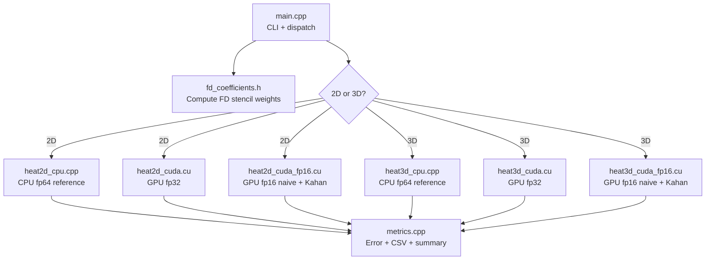

# CUDA Heat Equation Repository — Analysis

## Overview

This is a semester project for an ACS course that solves the **heat equation** on an NVIDIA GPU. The core research question is: *can half-precision (fp16) storage recover float32-level accuracy via Kahan compensated summation?* The answer, demonstrated across 84 benchmark points, is **yes**.

---

## What Is Already Implemented

### Core Solver — 4 Computation Variants × 2 Dimensions

| Variant | 2D File | 3D File | Precision |
|---|---|---|---|
| CPU reference | [heat2d_cpu.cpp](src/heat2d_cpu.cpp) | [heat3d_cpu.cpp](src/heat3d_cpu.cpp) | fp64 |
| CUDA fp32 | [heat2d_cuda.cu](src/heat2d_cuda.cu) | [heat3d_cuda.cu](src/heat3d_cuda.cu) | fp32 |
| CUDA fp16 naive | [heat2d_cuda_fp16.cu](src/heat2d_cuda_fp16.cu) | [heat3d_cuda_fp16.cu](src/heat3d_cuda_fp16.cu) | fp16 storage, fp32 compute |
| CUDA fp16 + Kahan | same file as fp16 naive | same file as fp16 naive | fp16 storage + fp32 compensation |

### Stencil Configuration

- **Configurable reach**: R = 1 to 8 (order 2 to 16 FD schemes)
- **Automatic FD coefficient computation** via Gaussian elimination at runtime — [fd_coefficients.h](include/fd_coefficients.h)
- **Automatic CFL stability limit** computed from von Neumann analysis with 80% safety margin
- **Neumann boundary conditions** applied via separate GPU kernels per timestep

### Infrastructure

| Component | File | Purpose |
|---|---|---|
| CLI & dispatch | [main.cpp](src/main.cpp) | Parses `-n`, `-t`, `-d`, `-r`, `-v`, `-o` flags; dispatches to 2D or 3D solvers |
| Data structures | [stencil.h](include/stencil.h) | `StencilConfig` (input) and `StencilResult` (output + timing + errors) |
| Error metrics | [metrics.cpp](src/metrics.cpp) | Max abs error, relative L2 error, NaN detection, CSV writer |
| Benchmark script | [run_benchmarks.sh](scripts/run_benchmarks.sh) | Sweeps 2D (N=64,128,256,512) + 3D (N=32,64,128), R=1,4,8 |
| Plotting | [plot_results.py](scripts/plot_results.py) | 7-plot visualization: accuracy, bandwidth, speedup for 2D/3D |
| Python references | [heat1d.py](../heat1d.py), [heat2d.py](../heat2d.py) | Prototype/validation scripts |

### Build System

- CMake 3.18+, targeting `sm_75` (Turing, GTX 1650)
- C++17, `--expt-relaxed-constexpr` for CUDA
- Release builds at `-O2`

---

## Architecture Observations

**Key patterns in the codebase:**
- FD coefficients stored in `__constant__` memory for fast broadcast reads
- Double-buffered grids (`u` / `u_next`) with pointer swap per timestep
- Boundary conditions applied via a separate kernel launch per timestep
- Kahan compensation uses a parallel `float*` array the same size as the grid
- `CUDA_CHECK` macro is copy-pasted across all `.cu` files (not shared)

---

## What Can Be Improved (Existing Code)

### 1. Code Duplication — High Priority

The codebase has **significant duplication** between 2D and 3D versions:
- `CUDA_CHECK` macro identical across 4 files.
- Init logic (source region) and timing/result packing logic repeated 8 times.
- `float_to_half` helper defined in multiple files.

### 2. Kernel Optimization — No Shared Memory

All kernels read **directly from global memory** for every neighbor. For R=8 in 3D, each thread loads **49 values** from global memory. Shared memory tiling could yield 2-3× speedup.

### 3. CPU Baseline — Single-Threaded

The CPU reference is single-threaded. Adding `#pragma omp parallel for` would give a fairer CPU vs GPU comparison.

---

## What Can Be Added (New Features - Priority Order)

1. **Shared Memory Tiling** (High Impact, Medium Effort)
2. **Temporal Blocking** (High Impact, High Effort)
3. **OpenMP CPU Parallelization** (Medium Impact, Low Effort)
4. **Unit Tests** (Medium Impact, Medium Effort)
5. **Roofline Model Analysis** (Medium Impact, Medium Effort)
6. **Multi-GPU Support** (High Impact, High Effort)
